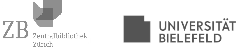

[home](index.md) | [people](people.md) | [corpus](corpus.md) | [resources](resources.md) | [program](summer_school_program.md)

## People

|  |  |  |  |
|-------|-------|-----------------|--------------|
|  | [Prof. Dr. Berenike Herrmann](https://jberenike.github.io/) | Scientific Lead | [Bielefeld University](https://www.uni-bielefeld.de/fakultaeten/linguistik-literaturwissenschaft/index.xml) |
|  | [Dr. Elias Kreyenbühl]() | Local Organizer | [Zürich Central Library](https://www.zb.uzh.ch/en) |
|  | [PD Dr. Jesko Reiling]() | Local Organizer | [Zürich Central Library](https://www.zb.uzh.ch/en) |
|  | [Dr. Giulia Grisot](https://giuliagrisot.github.io/) | Instructor | [Bielefeld University](https://www.uni-bielefeld.de/fakultaeten/linguistik-literaturwissenschaft/index.xml) |
|  | [Dr. Simone Rebora](https://github.com/SimoneRebora/) | Instructor | [Bielefeld University](https://www.uni-bielefeld.de/fakultaeten/linguistik-literaturwissenschaft/index.xml) |

## Partners

- [Zentralbibliothek Zürich](https://www.zb.uzh.ch/en)
- [Universität Bielefeld](https://www.uni-bielefeld.de/(en)/)
